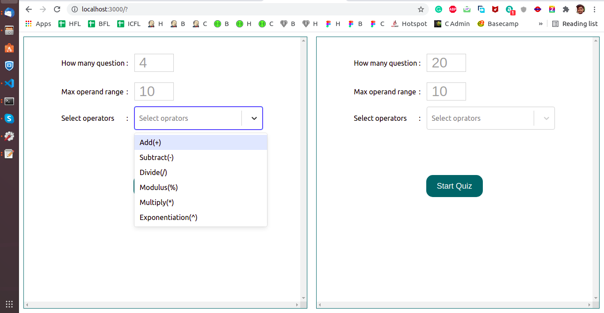
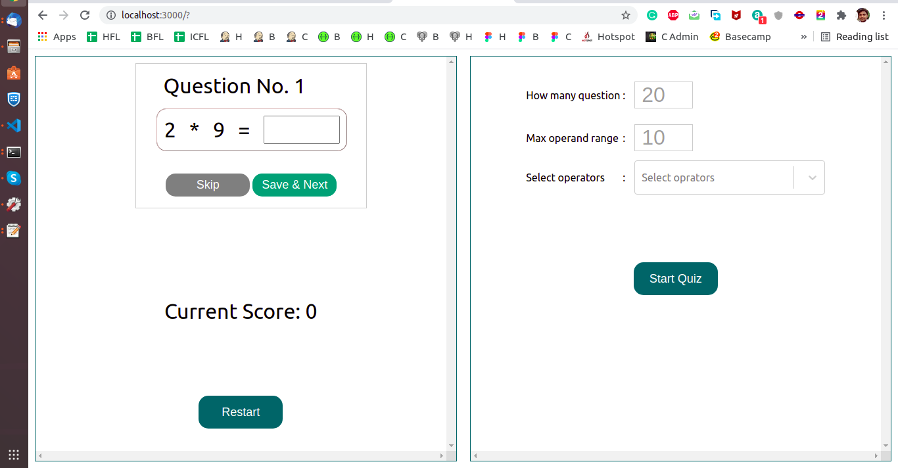
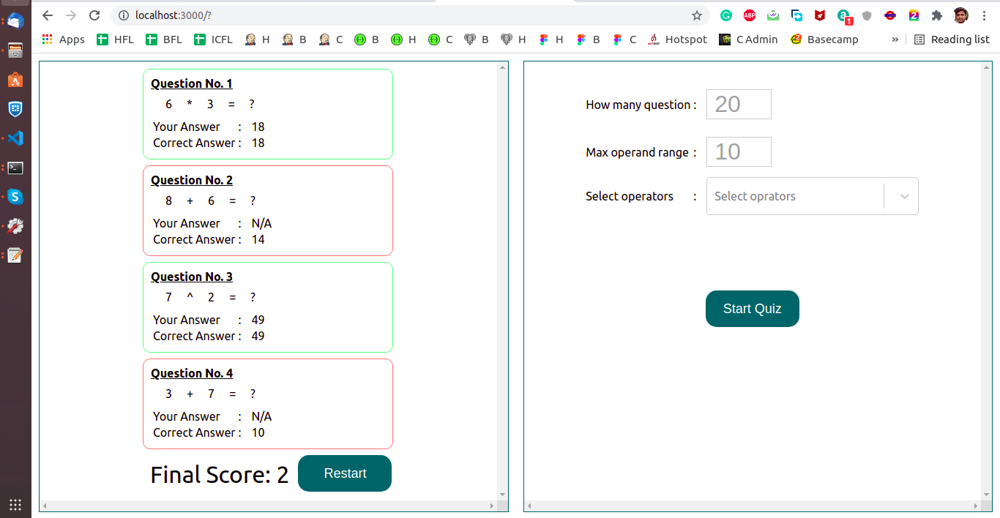
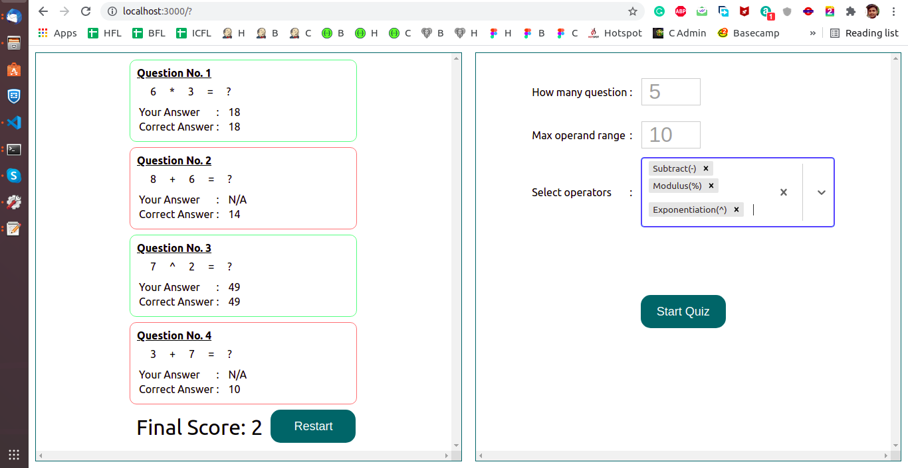
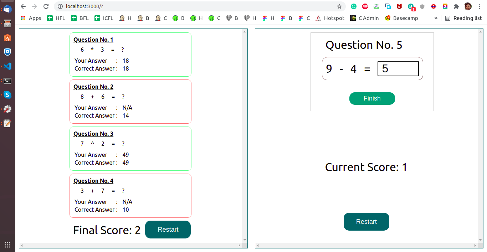
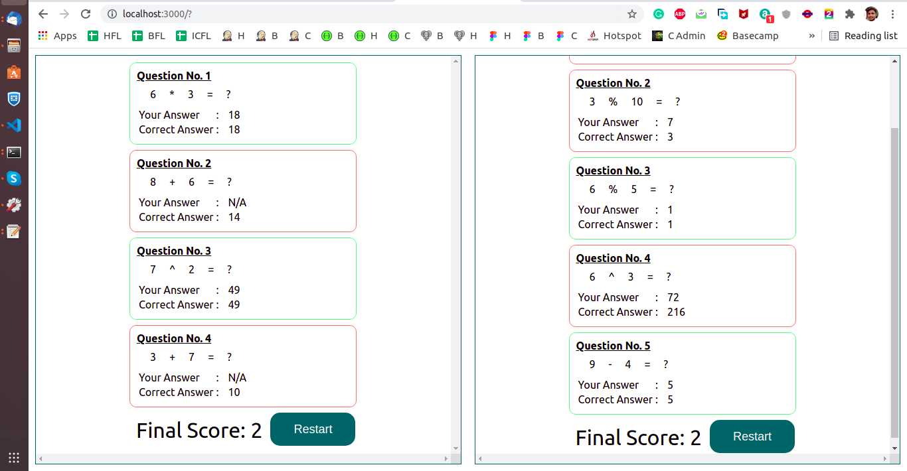

# JS Excercise VinSol

  
  
  
  
  
  
  
  

## Project Details

- On a web page, there will be two quizzes running simultaneously.

- When the user loads that web page, the web page will be divided into two quiz section.

- Each quiz section will show a "Start Quiz" button on clicking that button, the quiz will start and asks 20 mathematical questions

- Not all 20 questions will be asked at once, the application will show questions one by one.

- The quiz should generate two random numbers less than 10 and then pick an operator randomly ( add, subtract, divide, multiply).

- User should be able to enter his answer, and click next button(until all questions are not attempted).

- The application should evaluate the answer when the user moves to the next screen and show the score at the bottom.

- User should not be allowed to go back and edit answers.

- Once all questions are attempted, show user the final score and all questions asked in the quiz. Highlight questions(in red color) which user did not answer or answer was incorrect. Show correct answer with the questions.

- Plus points if the exercise solution is generic, like user can choose how many questions in a quiz, what range of random number(instead of 10 users can choose operands up to 15), user can select operators he wants to practice in the quiz.

## To Execute

### Clone the repository

``git clone https://github.com/rahul-vedant/js-excercise-vinsol.git``

### Available Scripts

In the project directory, you can run:

#### `npm start`

Runs the app in the development mode.\
Open [http://localhost:3000](http://localhost:3000) to view it in the browser.

The page will reload if you make edits.\
You will also see any lint errors in the console.

#### `npm run build`

Builds the app for production to the `build` folder.\

The build is minified and the filenames include the hashes.\
Your app is ready to be deployed!

### `npx serve -s build`
The build folder is ready to be deployed.
You may serve it with a static server:

``npx serve -s build``

  or

``npm install -g serve``
``serve -s build``

  
